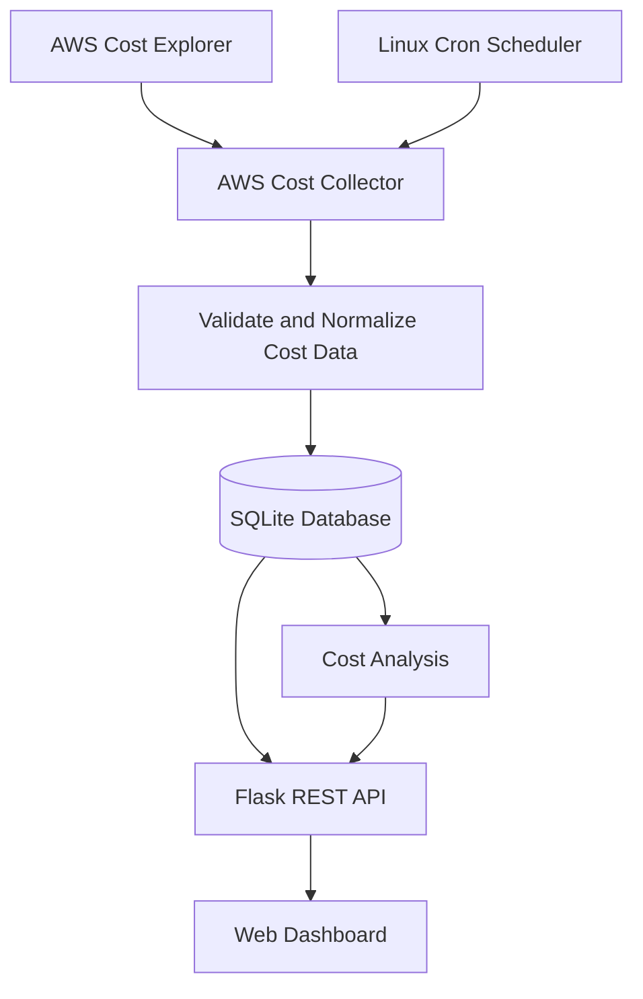
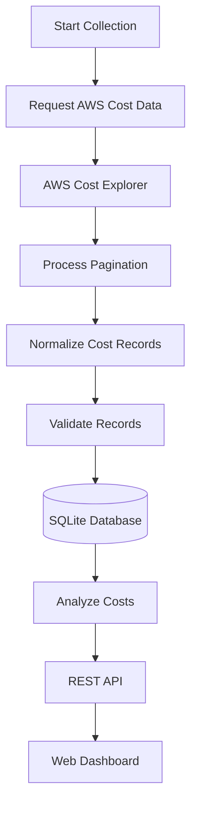
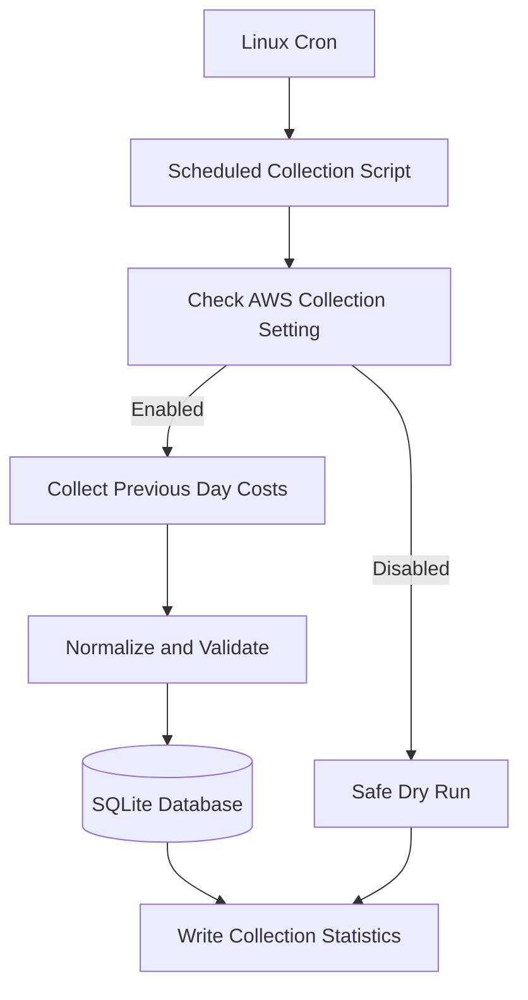
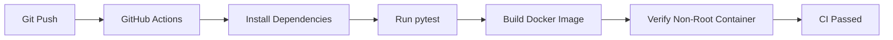
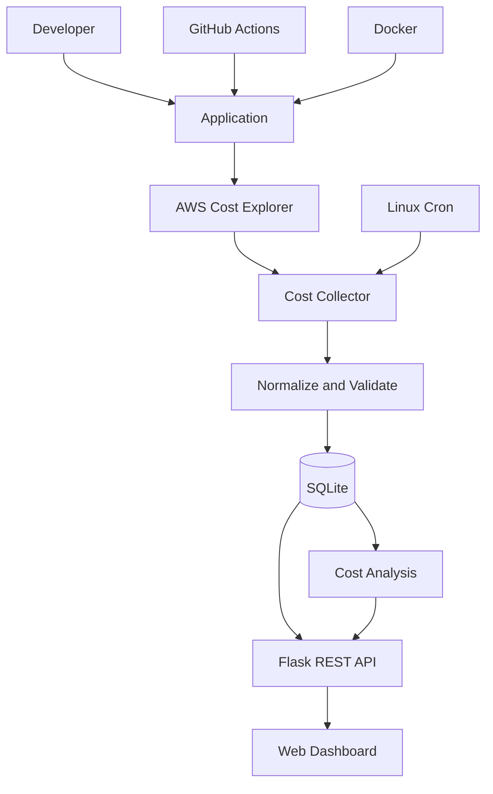

# Cloud Cost Optimization Dashboard

A lightweight cloud cost monitoring and analysis platform built with **Python, Flask, AWS Cost Explorer, and SQLite**.

The project collects cloud cost data, normalizes and stores it, analyzes service and daily spending, and presents the results through REST APIs and a web dashboard.

It combines cloud cost collection, data processing, persistence, analysis, scheduling, containerization, testing, and CI automation into one DevOps-oriented platform.

---

## Architecture



---

## Features

- AWS Cost Explorer integration
- Daily AWS cost collection
- AWS service-level cost grouping
- Cost response normalization
- SQLite cost storage
- Service and date filtering
- Duplicate cost record protection
- Service cost analysis
- Daily cost analysis
- Daily cost change detection
- Spending spike detection
- Service cost concentration analysis
- Service cost ranking
- REST API
- Web dashboard
- Scheduled daily collection
- Collection success and failure logging
- Docker containerization
- Non-root Docker container execution
- HTTP security headers
- Automated testing
- GitHub Actions CI
- Dependabot dependency updates

---

## Tech Stack

| Technology | Purpose |
|---|---|
| Python 3.12 | Application runtime |
| Flask | REST API and dashboard |
| Boto3 | AWS integration |
| AWS Cost Explorer | Cloud cost data |
| SQLite | Local persistence |
| Docker | Containerization |
| Bash | Operational scripting |
| Git | Version control |
| GitHub | Source repository |
| GitHub Actions | CI automation |
| pytest | Automated testing |
| Cron | Scheduled collection |

---

## Project Status

**Version:** v1.0.0  
**Status:** Completed

The current version includes AWS cost collection, cost analysis, SQLite persistence, REST APIs, dashboard visualization, scheduled collection, Docker containerization, automated testing, and CI automation.

---

## Project Structure

```text
cloud-cost-optimization-dashboard/
│
├── app/
│   ├── api.py
│   ├── aws_cost_collector.py
│   ├── config.py
│   ├── cost_analyzer.py
│   ├── cost_collector.py
│   ├── cost_service.py
│   ├── database.py
│   └── scheduler.py
│
├── data/
│   └── sample_costs.json
│
├── database/
│   └── costs.db
│
├── scripts/
│   ├── load_sample_data.py
│   └── run_scheduled_collection.sh
│
├── tests/
│   ├── test_api.py
│   ├── test_aws_cost_collector.py
│   ├── test_config.py
│   ├── test_cost_analyzer.py
│   ├── test_cost_collector.py
│   ├── test_cost_service.py
│   ├── test_database.py
│   └── test_scheduler.py
│
├── .github/
│   ├── dependabot.yml
│   └── workflows/
│       └── ci.yml
│
├── .dockerignore
├── .gitignore
├── Dockerfile
├── README.md
└── requirements.txt
```

---

## Directory Overview

| Directory / File | Purpose |
|---|---|
| `app/` | Application source code |
| `app/api.py` | Flask REST API and web dashboard |
| `app/aws_cost_collector.py` | AWS Cost Explorer collection |
| `app/config.py` | Application and AWS configuration |
| `app/cost_analyzer.py` | Cost analysis and insight calculations |
| `app/cost_collector.py` | Cost record validation and processing |
| `app/cost_service.py` | Application service layer |
| `app/database.py` | SQLite database operations |
| `app/scheduler.py` | Scheduled cost collection logic |
| `data/` | Sample cost data |
| `database/` | Local SQLite database |
| `scripts/` | Operational and scheduled collection scripts |
| `tests/` | Automated test suite |
| `.github/` | GitHub Actions and Dependabot configuration |
| `Dockerfile` | Container image definition |

---

## Installation

Clone the repository:

```bash
git clone https://github.com/anuragdeploys/cloud-cost-optimization-dashboard.git
cd cloud-cost-optimization-dashboard
```

Create the Python 3.12 virtual environment:

```bash
python3.12 -m venv venv312
```

Activate the environment:

```bash
source venv312/bin/activate
```

Install dependencies:

```bash
pip install -r requirements.txt
```

---

## Quick Start

### Run Tests

```bash
pytest -q
```

### Load Sample Data

```bash
python -m scripts.load_sample_data
```

Sample data allows the dashboard to be tested locally without making AWS Cost Explorer requests.

The database also protects against duplicate cost records.

### Start the Application

```bash
python -m app.api
```

The application runs on:

```text
http://localhost:5000
```

Open the address in a browser to view the dashboard.

---

## Cost Collection Workflow



The collection lifecycle is:

1. Request cost data from AWS Cost Explorer.
2. Retrieve AWS service-level cost information.
3. Process paginated responses.
4. Normalize AWS responses into application records.
5. Validate cost records.
6. Store records in SQLite.
7. Analyze stored costs.
8. Expose results through REST APIs.
9. Display results through the dashboard.

---

## AWS Cost Explorer Integration

The application uses **Boto3** to collect real AWS Cost Explorer data.

The collector provides:

- Daily cost collection
- AWS service-level grouping
- Configurable AWS profile
- Configurable AWS region
- Pagination handling
- Retry configuration
- AWS error handling
- Credential error handling
- Date-range validation
- Repeated pagination-token protection

Real AWS collection is **disabled by default**.

This allows the application to run locally with sample data without making AWS Cost Explorer requests unless collection is explicitly enabled.

Example normalized record:

```text
date: 2026-09-01
service: AWS Glue
amount: 0.00
```

---

## Cost Analysis

Stored cost records are processed by the analysis layer.

The dashboard provides:

- Total cost
- Cost by service
- Daily cost totals
- Daily cost changes
- Service cost ranking
- Service cost concentration
- Daily spending spike detection

The analysis is rule-based and operates on normalized cost records stored in SQLite.

---

## Database

SQLite is used as the project's local persistence layer.

Cost records contain:

- Date
- Service
- Amount
- Currency

The database provides:

- Persistent cost storage
- Service filtering
- Date filtering
- Duplicate protection
- Local development without an external database service

Duplicate records are protected using database-level uniqueness rules.

---

## API Overview

| Method | Endpoint | Purpose |
|---|---|---|
| GET | `/` | Web dashboard |
| GET | `/health` | Application health |
| GET | `/costs` | Retrieve cost records |
| GET | `/costs/summary` | Retrieve cost summary |
| GET | `/costs/insights` | Retrieve cost insights |

### Health Check

```bash
curl http://localhost:5000/health
```

### Cost Records

```bash
curl http://localhost:5000/costs
```

### Cost Summary

```bash
curl http://localhost:5000/costs/summary
```

### Cost Insights

```bash
curl http://localhost:5000/costs/insights
```

The `/costs` endpoint supports service and date-range filtering.

---

## Scheduled Collection

The project supports automated daily collection of the previous day's AWS costs using Linux cron.



The scheduler:

1. Calculates the previous day's date range.
2. Starts AWS cost collection.
3. Normalizes the AWS response.
4. Stores cost records.
5. Reports inserted and duplicate records.
6. Writes operational information to the log.

The scheduled process also has a safe disabled mode when AWS collection is not enabled.

### Cron Configuration

Example:

```text
@daily /root/cloud-cost-optimization-dashboard/scripts/run_scheduled_collection.sh
```

The scheduled script:

- Enters the project directory
- Activates the Python 3.12 environment
- Checks whether AWS collection is enabled
- Runs scheduled collection when enabled
- Records collection statistics
- Logs failures and exit codes
- Performs a safe dry-run path when AWS collection is disabled

---

## Configuration

The application supports environment-based configuration.

Default AWS configuration:

```text
AWS Profile: cost-dashboard
AWS Region: us-east-1
```

Configuration variables:

```text
COST_AWS_PROFILE
COST_AWS_REGION
COST_DATABASE_FILE
ENABLE_AWS_COLLECTION
```

AWS collection is disabled by default:

```text
ENABLE_AWS_COLLECTION=false
```

To explicitly enable collection:

```text
ENABLE_AWS_COLLECTION=true
```

The database path can also be changed using:

```text
COST_DATABASE_FILE
```

---

## Docker

The application is containerized using Docker.

### Build

```bash
docker build -t cloud-cost-dashboard .
```

### Run

```bash
docker run --rm -p 5001:5000 cloud-cost-dashboard
```

The application listens on port `5000` inside the container.

The Docker runtime uses Python 3.12.

---

## Container Security

The Docker container runs as a dedicated non-root application user.

The container includes:

- Dedicated application user
- Non-root runtime execution
- Writable application directories for database and logs
- Python 3.12 runtime

The GitHub Actions pipeline also verifies that the container does not run as UID `0`.

---

## HTTP Security

The Flask application adds baseline HTTP security headers:

- `X-Content-Type-Options`
- `X-Frame-Options`
- `Referrer-Policy`

These headers are applied to application responses through Flask's response lifecycle.

---

## CI/CD

GitHub Actions automatically validates the project.



The CI workflow verifies:

- Python 3.12 environment
- Project dependencies
- Automated tests
- Docker image build
- Non-root container execution

---

## Dependency Management

Dependabot monitors project dependencies.

It checks:

- Python dependencies
- GitHub Actions dependencies

Updates are configured on a weekly schedule.

Configuration:

```text
.github/dependabot.yml
```

---

## Testing

The project uses **pytest** for automated testing.

The test suite covers:

- AWS Cost Explorer collection
- AWS response normalization
- AWS pagination
- Repeated pagination-token protection
- AWS retry configuration
- AWS error handling
- Date validation
- Cost calculations
- Cost analysis
- Database operations
- Duplicate protection
- API endpoints
- Configuration
- Scheduled collection
- Security headers

Run the complete test suite:

```bash
pytest -q
```

Current test status:

```text
86 tests passed
```

---

## Complete Project Workflow



The platform combines cloud cost collection, data processing, persistence, analysis, API development, scheduling, containerization, and CI automation into one DevOps-oriented project.

---

## Engineering Highlights

### Cloud Integration

AWS Cost Explorer is integrated through Boto3 to collect real cloud cost information.

### Data Processing

AWS responses are normalized into a consistent internal cost-record format before persistence.

### Reliability

The collector includes pagination handling, retry configuration, AWS error handling, and repeated pagination-token protection.

### Persistence

SQLite provides lightweight local persistence with service/date filtering and duplicate protection.

### Automation

Linux cron provides scheduled daily cost collection.

### API Development

Flask exposes cost records, summaries, insights, and health information through REST endpoints.

### Containerization

Docker packages the application into a reproducible Python 3.12 runtime.

### Container Security

The application runs as a non-root user inside the container.

### CI Automation

GitHub Actions runs automated tests, builds the Docker image, and verifies non-root container execution.

---

## Future Improvements

Potential future improvements include:

- AWS multi-account cost collection
- Multi-region cost analysis
- Additional cloud provider support
- Cost forecasting
- Budget threshold alerts
- Email notifications
- Slack notifications
- Historical cost comparison
- Advanced optimization recommendations
- Authentication and authorization
- Production database support
- Advanced dashboard visualizations
- Kubernetes deployment
- CloudWatch integration

---

## License

This project is licensed under the MIT License.

---

## Author

**Anurag Varma**

GitHub:

https://github.com/anuragdeploys

## Repository

GitHub Repository:

https://github.com/anuragdeploys/cloud-cost-optimization-dashboard


